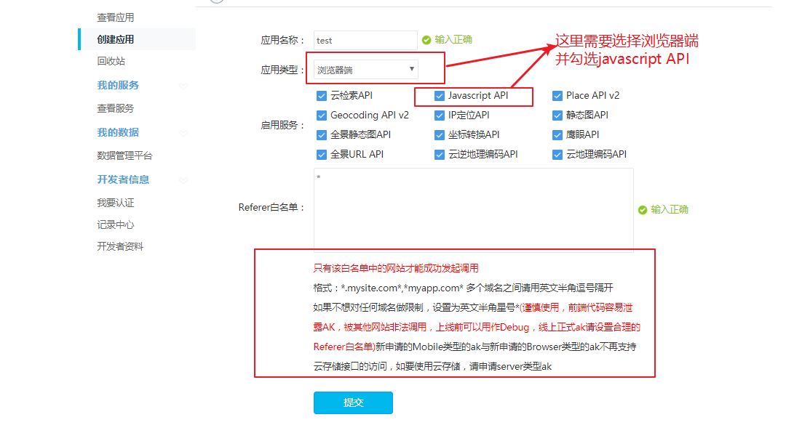
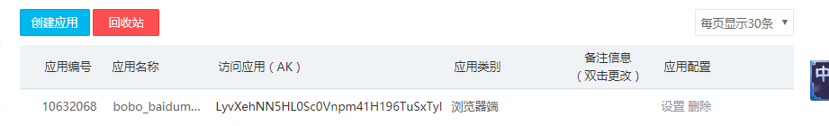
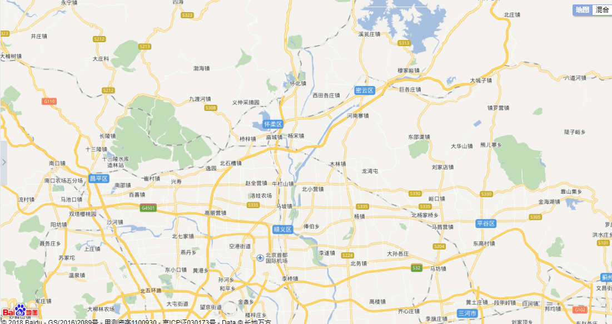
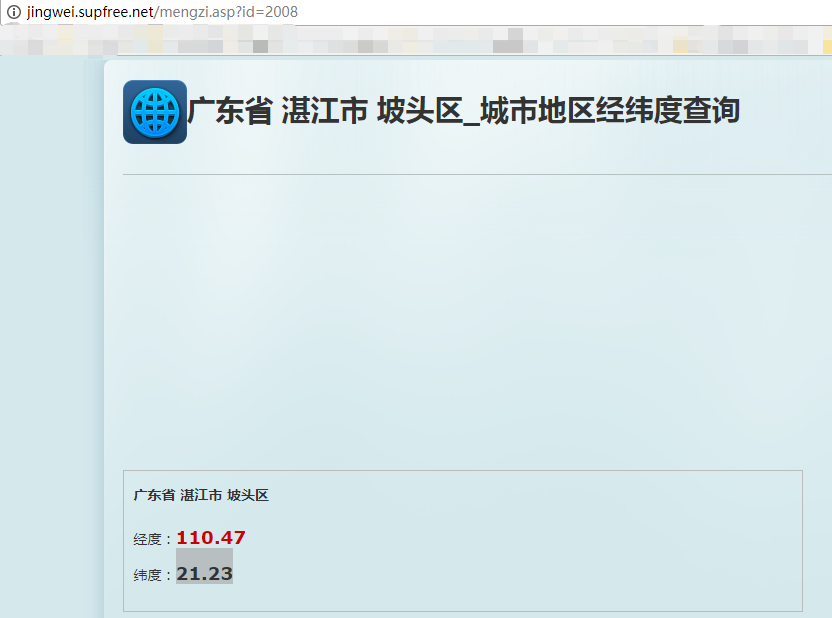
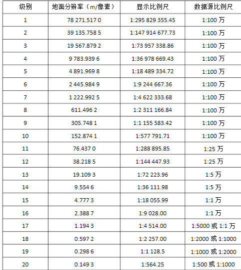

[演示地址](http://jackie_bobo.coding.me/baiDuMap)

##账号和获取密钥

### 使用方法

​	1.[注册百度账号](https://passport.baidu.com/)

​	2.[申请成为百度开发者](http://lbsyun.baidu.com/apiconsole/key)

​	3.[获取服务密钥（ak）](http://lbsyun.baidu.com/apiconsole/key/create)

​	4.[使用相关服务功能](http://lbsyun.baidu.com/index.php?title=jspopular)

### 版本说明

该套API免费对外开放，目前最新版本为JavaScript API V2.0。

旧版本已下线，为保证您的使用没有问题，建议采用最新版本进行开发。

###ak申请

> JavaScript API只支持浏览器类型的ak（自2016年1月15日升级）。请开发者在申请ak时注意选择。
>
> 其他使用问题请参考[常见问题](http://lbsyun.baidu.com/index.php?title=jspopular/qa)。
>
> 服务配额
>
> 您需先[申请密钥（ak）](http://lbsyun.baidu.com/apiconsole/key?application=key)才可使用该服务，接口无使用次数限制，请开发者放心使用。
>
> 如有问题请随时通过[API论坛](http://bbs.lbsyun.baidu.com/forum.php?mod=forumdisplay&fid=5)联系我们。

- **创建第一个应用获取对应的ak**



- **创建成功**

  


## 创建一个百度地图

开始学习百度地图API最简单的方式是看一个简单的示例。该示例帮助您快速了解百度地图API的基本使用，快速创建一张“我的地图”。

```js
<!DOCTYPE html>  
<html>
<head>  
<meta name="viewport" content="initial-scale=1.0, user-scalable=no" />  
<meta http-equiv="Content-Type" content="text/html; charset=utf-8" />  
<title>Hello, World</title>  
<style type="text/css">  
html{height:100%}  
body{height:100%;margin:0px;padding:0px}  
 /*设置容器样式*/
#container{height:100%}  
</style>  
<script type="text/javascript" src="http://api.map.baidu.com/api?v=2.0&ak=您的密钥">
//v2.0版本的引用方式：src="http://api.map.baidu.com/api?v=2.0&ak=您的密钥"
</script>
</head>  
<body>  
<div id="container"></div> 
<script type="text/javascript"> 
// 创建地图实例  
var map = new BMap.Map("container");
// 创建点坐标  
var point = new BMap.Point(116.404, 39.915);
// 初始化地图，设置中心点坐标和地图级别
map.centerAndZoom(point, 15);
</script>  
</body>  
</html>
```

效果如下：



**代码介绍**

-  **1.申请百度账号和ak**

  > [点我申请](http://lbsyun.baidu.com/apiconsole/key)

- **2.准备页面**

```html
<!DOCTYPE html>
```

您也可以根据需要选择其他类型的文档声明，这样浏览器会以标准的方式对页面进行渲染，保证页面最大的兼容性。我们不建议您使用quirks模式进行开发。

- **3.适应移动端页面展示**

```html
<meta name="viewport" content="initial-scale=1.0, user-scalable=no" />  
```

- **4.设置容器样式**

```css
<style type="text/css">  
    html{height:100%}    
    body{height:100%;margin:0px;padding:0px}    
    #container{height:100%}    
</style> 
```

- **5.引用百度地图API文件**

```js
<script type="text/javascript" src="http://api.map.baidu.com/api?v=2.0&ak=您的密钥"></script>
```

- **6创建地图容器元素**

```html
<div id="container"></div> 
```

- **7.创建地图实例**

```js
var map = new BMap.Map("container"); 
```

- **注意**

1.在调用此构造函数时应确保容器元素已经添加到地图上。

2.命名空间 API使用BMap作为命名空间，所有类均在该命名空间之下，比如：BMap.Map、BMap.Control、BMap.Overlay。

**8.设置中心点坐标**



```js
var point = new BMap.Point(110.47, 21.23); 
```

请注意：在使用百度地图JavaScript API服务时，需使用百度BD09坐标，如使用其他坐标（ WGS84、GCJ02）进行展示，

需先将其他坐标转换为BD09，详细说明请参考坐标转换说明，请勿使用非官方的转换方法！！！

- **9.地图初始化，同时设置地图展示级别**

```js
map.centerAndZoom(point, 15);  
```

关于地图显示级别



## **坐标转换**

> 目前国内主要有以下三种坐标系：
>
> WGS84：为一种大地坐标系，也是目前广泛使用的GPS全球卫星定位系统使用的坐标系。
>
> GCJ02：又称火星坐标系，是由中国国家测绘局制订的地理信息系统的坐标系统。由WGS84坐标系经加密后的坐标系。
>
> BD09：为百度坐标系，在GCJ02坐标系基础上再次加密。其中bd09ll表示百度经纬度坐标，bd09mc表示百度墨卡托米制坐标。
>
> 非中国地区地图，服务坐标统一使用WGS84坐标。
>
> 其他坐标转百度坐标
>
> 百度对外接口的坐标系为**BD09**坐标系，并不是GPS采集的真实经纬度，在使用百度地图JavaScript API服务前，需先将非百度坐标通过坐标转换接口转换成百度坐标。 坐标转换、批量坐标转换示例详见[**JavaScript API示例**](http://lbsyun.baidu.com/jsdemo.htm#a5_2)。
>
> 注意：请勿使用其他非官方转换方法！！！

## 自定义个性地图

[官网](http://developer.baidu.com/map/custom/)